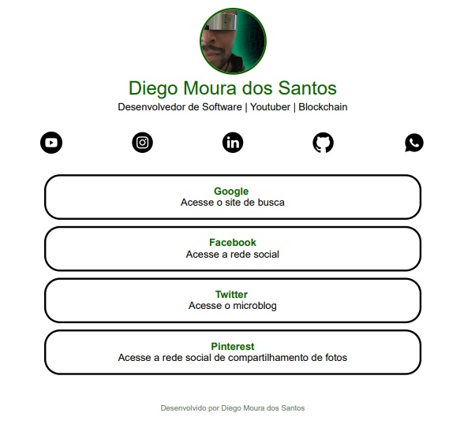

<h1 align="center"> 📚 Projeto LinkTree  </h1>

<p align="center"> Atráves desse simples projeto você será capaz de entender os conceitos 
básico do HTML e CSS. Com conhecimento em JavaScript você pode aprimorar esse projeto. Também é
possível fazer ele com o framework bootstrap.</p>
<br>

<p align="center"> 👇 Copie e cole o link no seu navegador, para visualizar o projeto. 👇</p>

```
https://programmercodeoficial.github.io/0002-LinkTree/
```
<br>

<p align="center">
        
</p>

## :stuck_out_tongue_winking_eye: Qual foi o objetivo?
<p> Treinar HTML e CSS básico.</p>
<ul>
  <li>CSS gradiente.</li>
  <li>Instalando fontes (google fontes).</li>
  <li>Entendo o modo resposivo (inspecionar). </li>
  <li>Introdução ao Flexbox.</li>
  <li>Entendo o display inline e display block.</li>
  <li>Entendo a tag SPAN.</li>
</ul>

## 🤝 Faça sua Contribuição
<p>
Este repositório foi criado para fins de estudo. Fique a vontade para contribuir!

Se te ajudei de alguma forma, ficarei feliz em saber.😜

Se você conhece alguém que se identifica com esse conteúdo, não deixe de compartilhar.

</p></br>

> ## Se possível

<p>

- ⭐️ Dê sua estrela ao projeto.

- 🐛 Encontre e relate issues.
</p>

Desenvolvido 😜 por [Diego Moura dos Santos](https://www.linkedin.com/in/diegomouradossantos/).
